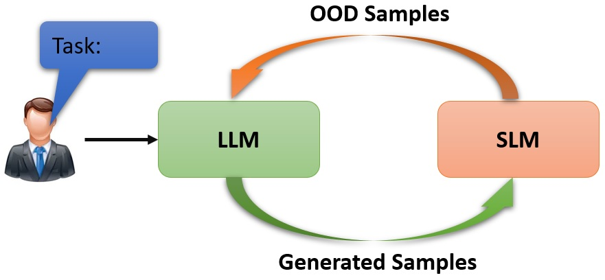

# Install dependencies:
```conda env create -f environment.yml```


# Experiments for Classification Tasks:
```
python T5_glue.py --scenario0 --num_batches 375 --data_dir generated_data/rte_ours/ --epochs 1 --generate_data  --dataset rte --fb val_ac
```

# Experiments for Seq-to-Seq Tasks:
```
python T5_squad.py --scenario1 --data_dir generated_data/svamp/ --num_batches 375 --epochs 1 --fb val_ac --dataset svamp  
```
